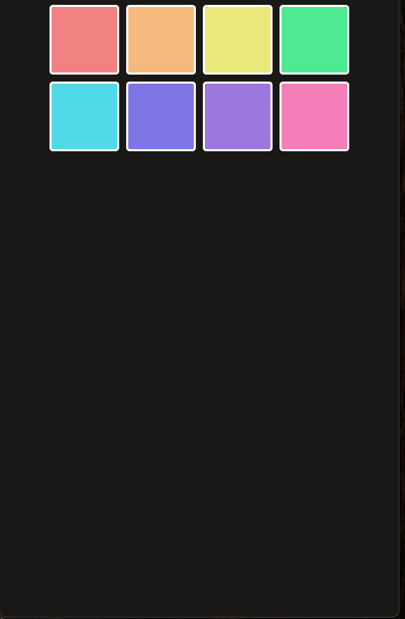

# Learning React

This repository is a list of projects and challenges I completed while learning react using a 'YouTube' tutorial (followed on scrimba and switched to YouTube towards the end). The tutorial took me through the basics of react web development (up until States). 

The course was also an opportunity to practice CSS because I'm not very good at it.

Most of the projects were built following the instructor's guide but the Assembly game was something I built without following the instructor. It's mostly functional (except for the changing of the message 
and confetti drop because it didn't seem like a game breaking feature).

I'm including screenshots of the projects and a link to the tutorial in case someone else would want to give it a shot

## Assembly Game 
This project was a capsone project in the course. It's basically Hangman for programming. You guess a random word and have 8 wrong attempts. This project I built myself without following the instructor so it's not neccessarily the cleanest code.
NB: I  didn't completely finish it (confetti doesn't drop when you win and the 'removed language' message changes after every try but they are minor functionality so I'm not too bothered). Also, it doesn't show the world if you got it wrong 

## Tenzies
This is a die game where the goal is to get all the dice to show the same number. You click on role and click on the number to "freeze" it so it doesn't change. Once you have all the die frozen on the same numbers, you win and can start a new game

## Chef Claude
This project is a recipie generator. You provide a list of ingredients and submit it to an AI model that suggests a recipe you can make. 

NB: I cheated on this as well. I have no intention of paying for an LLM subscription thing to learn react so I just have a file that returns a sample response for the recipe (copied from the video). 

## Meme generator
This project just overlays text over a meme image. It was to learn about controlled components which was kinda cool I guess

## Pad colour switcher
I don't remember what this project was about (maybe props) but it's basically a list of pads that switch on and off when you click on them

## State Counter
This app is a basic counter app that adds and subtracts from a counter variable based on the number of times the instructor says counter (you actually have to click it but okay)

## Contact App
This app is a contact card for cats with funny games.

## Contact Card
This is a contact card that where clicking on the star toggles the favourite star for the contact

## My Travel Journal
This is a travel journay that shows places some fictional character has visited (definitely not me). It was a chance to learn about custom components

## Facts About React
This project was one of the first challenges to learn the basics of react, setting up a project, writing some basic code and CSS

## Facts About React - Redo
This project is a redo of the previous one to learn the basics of react

## Window Width Tracker
This is a project that tracks how wide the current window is

